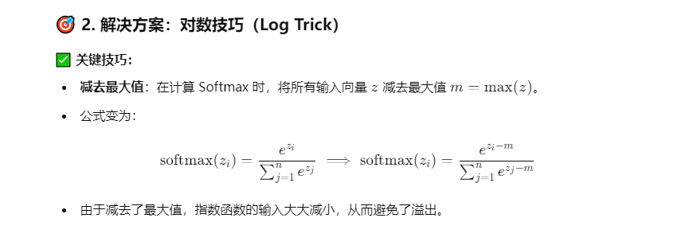

# Transformer的问题

## 请问你对Transformer有什么了解

简要回答的话可以这样：

Transformer是一种**基于自注意力机制的神经网络架构**，它主要用于处理序列数据，如自然语言处理。

核心的组件有：自注意力机制（**计算序列中每个元素与其他元素的相关性，捕捉长距离依赖**）、多头注意力（**通过多个注意力头并行计算，捕捉不同子空间的信息**）、位置编码（**为输入序列添加位置信息，弥补Transformer缺乏序列感知的不足**）、前馈神经网络（**对每个位置的表示进行非线性变换**）、残差连接和层归一化（**缓解梯度消失，加速训练**）

优势：并行计算、长距离依赖、可扩展性

以下是一些常见的不足和改进方向：

---

### 1. **计算复杂度高**

- **问题**：**自注意力机制的计算复杂度是 \(O(n^2)\)**，其中 \(n\) 是序列长度。对于长序列（如长文档或高分辨率图像），计算和内存开销非常大。
- **改进方向**：
    - **使用稀疏注意力（Sparse Attention）或局部注意力（Local Attention）来减少计算量**。
    - **引入线性注意力（Linear Attention）或低秩近似（Low-Rank Approximation）来降低复杂度**。
    - **分块处理长序列**（如Longformer、BigBird等模型）。

---

### 2. **缺乏位置感知能力**

- **问题**：Transformer本身没有显式的序列顺序信息，依赖位置编码来引入位置信息。**但位置编码在长序列中可能表现不佳，尤其是对于超出训练时最大序列长度的输入**。
- **改进方向**：
    - **使用相对位置编码（Relative Positional Encoding）或可学习的位置编码**。
    - 在注意力机制中直接引入位置信息（如Transformer-XL）。

---

### 3. **数据需求量大**

- **问题**：Transformer通常需要大量数据才能训练出较好的效果，尤其是在预训练阶段。对于小数据集，Transformer可能表现不佳。
- **改进方向**：
    - **使用迁移学习，通过预训练模型（如BERT、GPT）在小数据集上进行微调**。
    - 数据增强（Data Augmentation）或合成数据来扩充训练集。

---

### 4. **训练成本高**

- **问题**：**Transformer模型的参数量通常很大**，训练需要大量计算资源（如GPU/TPU）和时间。
- **改进方向**：
    - 使用模型压缩技术，如剪枝（Pruning）、量化（Quantization）和蒸馏（Distillation）。
    - 分布式训练或混合精度训练来加速训练过程。

---

### 5. **对局部信息的捕捉能力有限**

- **问题**：自注意力机制更擅长捕捉全局依赖，但在某些任务中（如语法解析或**局部特征提取**），局部信息的捕捉可能不如RNN或CNN。
- **改进方向**：
    - **结合CNN和Transformer（如Convolutional Transformer）。**
    - **在注意力机制中引入局部窗口（如Swin Transformer）。**

---

### 6. **长序列建模的挑战**

- **问题**：虽然Transformer理论上可以处理长序列，但在实际应用中，长序列会导致注意力权重稀疏，难以有效建模。
- **改进方向**：
    - 使用稀疏注意力机制（如Longformer、BigBird）。
    - 分层次建模（如Hierarchical Transformer）。

---

### 7. **解释性差**

- **问题**：Transformer的自注意力机制虽然强大，但其决策过程缺乏解释性，难以理解模型的具体行为。
- **改进方向**：
    - 使用可视化工具分析注意力权重。
    - 结合可解释性更强的模型（如规则-based 方法）进行混合建模。

---

### 8. **对噪声敏感**

- **问题**：Transformer对输入数据的质量要求较高，如果输入数据噪声较大（如拼写错误、语法错误），模型性能可能下降。
- **改进方向**：
    - 在预处理阶段加入数据清洗和纠错机制。
    - 使用对抗训练（Adversarial Training）增强模型的鲁棒性。

---

## Q、K、V的作用分别是

在 Attention 机制中，KQV 是一组与序列中每个元素对应的三个矩阵，其中 K 和 V 分别代表键和值，用于计算对应元素的权重，Q 代表查询向量， 用于确定权重分配的方式。三个矩阵 K、Q、V 在 Attention 机制中的具体作用如下：

- K（Key）矩阵：K 矩阵用于计算每个元素的权重，是一个与输入序列相同大小的矩阵。通过计算查询向量 Q 与每个元素的相似度， 确定每个元素在加权平均中所占的比例。
- Q（Query）向量：Q 向量是用来确定权重分配方式的向量，与输入序列中的每个元素都有一个对应的相似度，可以看作是一个加权的向量。
- V（Value）矩阵：V 矩阵是与输入序列相同大小的矩阵，用于给每个元素赋予一个对应的特征向量。在 Attention 机制中， 加权平均后的向量就是 V 矩阵的加权平均向量。

通过K、Q、V三个矩阵的计算，Attention机制可以自适应地为输入序列中的每个元素分配一个权重，以实现更好的特征表示。

## **为什么 self-attention 可以堆叠多层，有什么作用？**

Self-attention 能够捕捉输入序列中的长距离依赖关系，通过堆叠多层 self-attention，模型可以学习序列中更深层次的模式和依赖关系。 多层 self-attention 就像神经网络中的多个隐藏层一样，使模型能够学习和表示更复杂的函数。

## 介绍一下QKV的计算过程和计算量

## 介绍一下Transformer中的参数量

## Transformer为何使用多头注意力机制？（为什么不使用一个头）

多头注意力机制的设计实际上是为了**让模型能够同时从不同角度理解和处理输入信息**。这种并行的多角度处理方式不仅**增强了模型的表达能力**，还带来了**类似集成学习的效果**。当多个头的输出被拼接和转换后，**模型获得了更丰富和稳健的特征表示**。即使某些头可能在特定情况下表现不佳，其他头仍然可以提供有价值的信息，这提升了模型的整体鲁棒性。虽然使用多头会增加模型参数量，但由于可以并行计算，对训练和推理速度的影响并不显著。这种设计在提供更强大的建模能力的同时，还保持了计算效率，这也是Transformer架构成功的重要原因之一。

## Transformer为什么Q和K使用不同的权重矩阵生成，为何不能使用同一个值进行自身的点乘？

- ***学习更灵活和丰富的特征表示***,如果使用相同的权重矩阵，Query和Key的特征表示会相同，**限制了模型在不同任务中提取特征的能力**，导致注意力分数缺乏多样性和灵活性。
- **捕获更复杂的上下文关系**,**如果Query和Key完全相同（权重矩阵相同），则模型实际上只是在计算自相关性**，**而非真正衡量输入序列中不同元素之间的复杂关系**。
- 提升训练的稳定性；
- 增强模型的表达能力和泛化能力。
- **使用不同权重的模型性能往往好于共享权重**

Q 和 K 使用不同的权重矩阵主要是为了增强模型的表达能力和灵活性，**避免在自注意力中引入退化现象**。虽然理论上可以共享权重，**但这样可能会导致模型的表现不足**，尤其是在复杂任务或长序列关系建模中。

## Transformer计算attention的时候为何选择点乘而不是加法？两者计算复杂度和效果上有什么区别？

Transformer选择点乘的主要原因是:

1. 计算效率更高，易于使用现代硬件(GPU/TPU)优化
2. **实现更简单，代码更简洁**
3. 在高维空间中表现更稳定
4. 不需要额外的参数，减少了模型复杂度

如果使用加法操作，为了得到有效的注意力分布，**通常需要额外的激活函数和非线性映射。这引入了额外的计算步骤，总复杂度可能比点乘稍高，尤其当维度较大时**。

## 为什么在进行softmax之前需要对attention进行scaled（为什么除以dk的平方根），并使用公式推导进行讲解

**其目的是为了稳定数值范围，避免过大的点积值导致 softmax 输出分布过于极端（尖锐）或不稳定**

- **控制数值范围**：**减小点积值的方差，避免高维特征引发值爆炸**。
- **平滑注意力分布**：**缓解 softmax 的指数放大效应，使模型捕捉更多的上下文信息**。
- **提高训练稳定性**：**缩小输入范围，减少梯度过大或过小的问题**。

## 在计算attention score的时候如何对padding做mask操作？

在计算 Attention Scores 时对 padding 做 mask 的关键步骤：

1. **构造 Mask 矩阵**，将 padding 位置设置为极小值（如 −∞）。
2. **添加到 Scores**，使 padding 位置在 softmax 后被归一化为 0。
3. **保证计算结果的正确性**，避免无效位置干扰有效的注意力分布。

$$\text{Attention}(Q,K,V)=\text{softmax}\left(\frac{QK^\top}{\sqrt{d_k}}+\text{Mask}\right)V$$

$$\text{Mask}=\begin{bmatrix}0&0&-\infty&0\\0&0&-\infty&0\\-\infty&-\infty&-\infty&-\infty\\0&0&-\infty&0\end{bmatrix}$$

## 为什么在进行多头注意力的时候需要对每个head进行降维？

对每个头进行降维是多头注意力中平衡性能、计算效率和表示能力的关键设计：

1. **控制参数量**，避免多头导致模型参数暴增。
2. **优化计算效率**，减小每头点积注意力的计算开销。
3. **鼓励特征多样性**，每头在降维后的不同子空间中关注不同特征。
4. **保持输出一致性**，通过线性变换恢复总输出维度为$d_{model}$

## 大概讲一下Transformer的Encoder模块？

Transformer 的 Encoder 模块是*堆叠的层状结构*，每层通过 **多头注意力** 和 **前向网络** 提取序列的全局和局部特征。它通过 **位置编码** 和 **残差连接** 保证了序列信息建模的有效性和模型的训练稳定性。

$$H_1=\text{LayerNorm}(X+\text{MHA}(X,X,X))$$

$$H_{2}=\text{LayerNorm}\left(H_{1}+\text{FFN}\left(H_{1}\right)\right)$$

$$\begin{array}{c}\text{Positional Encoding}(i, 2k)=\sin \left(i / 10000^{2k / d_{\text {model }}}\right) \\\text { Positional Encoding }(i, 2k+1)=\cos \left(i / 10000^{2k / d_{\text {model }}}\right)\end{array}$$

## 为何在获取输入词向量之后需要对矩阵乘以embedding size的开方？意义是什么？

在 Transformer 模型中，对输入词向量进行位置编码并通过嵌入层后，有一个步骤是将词嵌入矩阵乘以嵌入维度的平方根$\sqrt{d_{model}}$。这个操作在 Transformer 的实现中体现了一种**归一化和数值稳定性调节**的设计理念

主要体现在以下几个方面：

1. **放大输入值的动态范围**：**避免初始数值过小影响注意力机制的点积结果和梯度传播**。
2. **增强训练稳定性**：通过数值调节，使嵌入和其他模块的计算保持一致的尺度。
3. **平衡词嵌入和位置编码的影响**：确保两者在加法操作中对模型训练有相近的贡献。

## 简单介绍一下Transformer的位置编码？有什么意义和优缺点？

Transformer 的位置编码**通过正余弦函数引入序列的位置信息，弥补了其本身缺乏顺序感知能力的缺点**。它设计简单且高效，适合大多数任务，但在某些情况下可能不如可学习的位置编码灵活。对于复杂结构的任务，改进或替代的编码方法可能更加合适.

**Transformer模型本身没有循环或卷积结构，因此无法直接感知输入序列中词语的顺序**。位置编码（Positional Encoding, PE）是 Transformer 引入的一种机制，用来补充序列中的位置信息，从而让模型能够捕获序列顺序的特征。

 **位置编码的计算公式**
**位置编码是通过固定的正弦和余弦函数生成的**，其公式为：
$$\begin{array}{c}\text { Positional Encoding }(i, 2 k)=\sin \left(i / 10000^{2 k / d_{\text {model }}}\right) \\\text { Positional Encoding }(i, 2 k+1)=\cos \left(i / 10000^{2 k / d_{\text {model }}}\right)\end{array}$$
其中：
$$pos$$ 表示词在序列中的位置。
 $$i$$表示嵌入维度中的索引。
$$d_{model}$$ 是嵌入向量的维度。

**通过这种方式，每个位置会生成一个与 $$d_{model}$$ 维度相同的向量**，具有以下特点：
- 不同位置的编码是不同的。
- 编码在嵌入维度上的变化具有一定的周期性。

2. **位置编码的特点**
(1) **捕捉相对位置关系**
- 不同位置的编码在数值上具有规律性，使得 Transformer 可以通过点积计算出相邻或远离位置之间的相对关系。
- 例如，位置之间的差值直接影响编码之间的点积结果，这种特性让模型能够感知序列顺序。

(2) **周期性**
- 高频信号（低维度）捕捉短距离关系，低频信号（高维度）捕捉长距离关系。
- 多尺度信息增强了模型对全局和局部关系的建模能力。
(3) **简单、高效**
- 位置编码是基于固定公式计算的，不需要额外的可学习参数。
- 适用于任意长度的序列，因为公式具有扩展性。

3. **位置编码的意义**
1. **弥补 Transformer 缺乏顺序信息的问题**：为每个输入词向量引入显式的位置信息，帮助模型理解输入的结构。
2. **相对位置关系的建模**：通过正余弦函数的规律性，编码能够在一定程度上表示词与词之间的相对位置。
3. **不依赖具体序列长度**：位置编码不需要预定义特定长度，可以灵活扩展到长序列。

 4. **优点**
- **简单高效**：通过固定公式生成，不增加模型的参数或计算复杂度。
- **平滑的位置信息变化**：正余弦函数具有连续性，有利于捕捉距离关系。
- **全局和局部信息兼顾**：不同频率的编码对应不同范围的依赖关系。

 5. **缺点**
1. **固定性**：**位置编码是固定的，在训练中不可调整**，可能限制模型对某些任务的适应能力。
- 可学习的位置编码（Learnable Positional Embedding）是解决此问题的一种替代方案。
2. **局限于相对距离表示**：尽管位置编码可以建模相对位置，但它对复杂的结构化位置信息（如树形或图结构）不敏感。
3. **长序列上的衰减**：**对于非常长的序列，较高位置的编码会因为指数缩放而逐渐失去影响力**。

## 你还了解哪些关于位置编码的技术，各自的优缺点是什么？

**选择方法时需考虑任务需求：**

- 长序列建模：选择 **RoPE**、ALiBi、相对位置编码。
- 对局部顺序敏感的任务：卷积位置编码或相对位置编码。
- 灵活性要求高的任务：可学习位置嵌入或动态位置编码。

## 简单讲一下Transformer中的残差结构以及意义。

- 残差结构通过跳跃连接**解决了深度神经网络中的梯度消失问题**，促进了训练的稳定性与效率。
- 它加速了网络的收敛过程，并能提高模型的表现，尤其是在处理深度网络时。
- 在 Transformer 中，**残差结构与层归一化结合使用**，使得模型不仅能够有效训练，还能保持较好的泛化能力。

### (1) **缓解梯度消失问题**

- 在深层神经网络中，梯度消失（或爆炸）是一个常见问题，特别是在训练时，**随着层数的增加，梯度会变得越来越小（或越来越大），导致训练困难**。
- 残差连接通过直接将输入信号加到输出上，使得信息能够直接流动到更深的层次，从而减轻了梯度消失问题。这使得即使在非常深的网络中，梯度也能够有效传播，提升训练稳定性。

### (2) **提高训练效率**

- 残差连接允许网络学习到与原始输入信号之间的差异（即“残差”），而不是完全从零开始学习。这样可以加速收敛过程，因为每个子层只需要学习输入与输出之间的差异。
- 在训练过程中，残差结构使得每个子层都可以通过增量方式优化，而不是完全重塑输入信号。

### (3) **改善模型表现**

- 残差连接使得网络更加灵活，能够表示更复杂的函数关系。它不仅能学习到每层的直接输出，还能更好地保留原始输入的特征，从而提高模型的表达能力。
- 在很多情况下，残差结构能够帮助模型达到更好的泛化能力，减少过拟合。

### (4) **增加深度可扩展性**

- 在没有残差连接的情况下，深度增加可能会导致性能下降，因为信息流动变得困难。引入残差连接后，网络深度可以进一步增加，而不会显著影响训练的效果，因此 Transformer 模型能够处理非常深的网络结构。

## 为什么transformer块使用LayerNorm而不是BatchNorm？LayerNorm 在Transformer的位置是哪里？

### 1. **BatchNorm 和 LayerNorm 的区别**：

- **BatchNorm**（批量归一化）通常在神经网络中用于每个小批次的训练数据，**通过对每一层的输入进行归一化来加速训练**。它在处理每个特征通道时，计算该通道在批次中的均值和标准差。
- **LayerNorm**（层归一化）则是**在每个样本内的所有特征维度上进行归一化**。即，计算每个样本内部的均值和标准差，而不是跨批次。它不依赖于批次的大小，因此适合于在每个样本独立处理的任务中使用。

### 2. **为什么 Transformer 选用 LayerNorm**：

- **Transformer 的训练过程依赖于序列长度和并行性**：由于 Transformer 中的每个输入样本（通常是句子或序列）可以具有不同的长度，且模型需要并行处理所有样本。**如果使用 BatchNorm，它依赖于批量内样本的统计信息，在每次计算时，批量大小对归一化的效果有很大影响，尤其在处理变长序列时，批次的统计信息可能会受到干扰**。
    
    **LayerNorm 在这种情况下非常适合，因为它是对每个输入样本（即每个序列）进行归一化，而与批量大小无关**，适应性更强。它能更好地处理变长输入（如机器翻译中的句子长度不同）和保证在不同输入序列长度下的稳定性。
    

### 3. **LayerNorm 在 Transformer 中的位置**：

Transformer 中的 **LayerNorm** 通常出现在以下几个地方：

- **多头注意力子层**：
    - 在每个子层（如多头注意力机制）之后，首先进行残差连接（将输入和子层的输出相加），然后进行 **LayerNorm**。这种顺序是为了保证输入信号的稳定流动，并防止梯度消失或爆炸。
- **前馈神经网络子层**：
    - 类似地，在前馈神经网络子层的残差连接后，也会进行 **LayerNorm** 处理。

具体来说，在 Transformer 中，**LayerNorm** 是这样使用的：

1. 输入通过多头注意力机制计算得到注意力输出。
2. 输出与输入进行残差连接，并将结果送入 **LayerNorm**。
3. 然后通过前馈神经网络进行处理。
4. 前馈网络的输出也经过残差连接，并进行 **LayerNorm** 处理。

因此，**LayerNorm 一般位于每个子层的后面，在每个子层的残差连接之后**。

---

### 总结：

- **BatchNorm** **依赖于批量信息，因此不适合处理不同长度的序列或在需要高度并行的模型中**。
- **LayerNorm** 是**按样本进行归一化，不受批量大小影响，适合 Transformer 这类结构，尤其是变长序列处理和并行化训练。**
- 在 Transformer 中，**LayerNorm** 出现在每个子层的后面，通常在残差连接后应用。

## 简答讲一下BatchNorm技术，以及它的优缺点。

**BatchNorm** 是一种深度神经网络中常用的技术，**旨在通过对每一层的输入进行归一化，减少训练过程中的内部协变量偏移（internal covariate shift），从而加速训练并提高模型的稳定性。**

### 1. **BatchNorm的工作原理**：

- 对每一层的输入，**BatchNorm** 在每个批次中计算均值和标准差，利用这些统计量对每个输入特征进行归一化。
    - 计算每个特征在批次中的均值和标准差。
    - 使用计算出的均值和标准差对每个样本的每个特征进行归一化。
    - 然后，使用可学习的缩放参数 γ 和偏移参数 β 对归一化后的输出进行线性变换，以恢复其表达能力。
        
        
        

### **优点**：

1. **加速训练**：
    - **BatchNorm** 可以通过缓解内部协变量偏移（Internal Covariate Shift），使得每层的输入分布保持相对稳定，从而加速模型的收敛速度。
2. **提高稳定性**：
    - 通过对每一层的输入进行归一化，**BatchNorm** 减少了梯度消失或爆炸的问题，从而提高了训练的稳定性。
3. **正则化效果**：
    - **BatchNorm** 具有轻微的正则化作用，因为它基于每个小批次的统计量，因此它在一定程度上可以防止过拟合，尤其是在没有显式正则化（如Dropout）的情况下。
4. **允许使用更高的学习率**：
    - 由于其加速训练和稳定性的作用，**BatchNorm** 使得使用较大的学习率成为可能，从而进一步加速训练过程。

### **缺点**：

1. **对批次大小敏感**：
    - **BatchNorm** 在计算均值和方差时依赖于整个批次的数据。如果批次大小过小，计算出的统计量可能不稳定，从而影响模型的性能。
2. **训练和推理时行为不一致**：
    - 在训练过程中，**BatchNorm** 使用的是批次的均值和方差，而在推理（测试）过程中，使用的是整个训练集的均值和方差。这种行为不一致可能导致推理阶段的性能下降，尤其是在批次大小较小或者数据分布发生变化时。
3. **增加计算开销**：
    - **BatchNorm** 需要额外的计算来计算均值、方差以及反向传播时的梯度，这增加了额外的计算和内存开销，尤其是在处理非常大的数据集时。
4. **不适合小批量数据**：
    - 对于小批量数据（如序列数据），由于每个批次的样本较少，均值和方差的估计可能不准确，从而影响模型性能。

## 简单描述一下Transformer中的前馈神经网络？使用了什么激活函数？相关优缺点？

在 Transformer 中，每个 **Encoder** 和 **Decoder** 都包含一个前馈神经网络（Feed-Forward Neural Network, FFN）。**该网络由两个全连接层和一个激活函数组成，作用是对每个位置的表示进行独立的非线性变换。**
使用了ReLU激活函数

### **优点**：

1. **非线性映射**：
    - 前馈神经网络引入了**非线性激活函数**（如 ReLU），**能够学习更复杂的特征映射，提高模型的表达能力**。
2. **增强模型的灵活性**：
    - 通过前馈网络，Transformer **可以在每个位置上进行独立的非线性变换**，**从而更好地捕捉输入序列中的复杂模式和关系**。
3. **简化计算**：
    - 前馈神经网络在每个位置上独立处理数据，因此它与自注意力机制（self-attention）并行工作，能够提升计算效率。

### **缺点**：

1. **计算开销**：
    - 尽管前馈神经网络的每一层都处理的是每个位置的独立数据，但由于每个位置都要通过两个全连接层，仍然增加了计算量和内存开销，尤其是在序列长度较长时。
2. **对序列间的依赖较弱**：
    - 相比自注意力机制，前馈神经网络只在每个位置上做独立的计算，缺乏跨位置的依赖建模。它的作用是对每个位置进行局部非线性变换，而不是直接捕捉序列中不同位置之间的关系。

## Encoder端和Decoder端是如何进行交互的？（在这里可以问一下关于seq2seq的attention知识）

- **Encoder 和 Decoder 之间的交互**主要通过 **Encoder-Decoder Attention** 实现，Decoder 在每一层通过对 Encoder 输出的关注，获取源序列的信息来生成目标序列。
- 具体来说，**Decoder 先计算自注意力，再计算与 Encoder 的交互**，通过 Encoder-Decoder Attention 将源序列的上下文信息融入到目标序列的生成中。这种交互机制是 Transformer 中实现源语言与目标语言信息传递的关键。

## Decoder阶段的多头自注意力和encoder的多头自注意力有什么区别？（为什么需要decoder自注意力需要进行 sequence mask)

### **Decoder 阶段的多头自注意力与 Encoder 的多头自注意力的区别**

在 **Transformer** 中，**Encoder** 和 **Decoder** 都使用多头自注意力（Multi-Head Self-Attention）机制，但两者的作用和计算方式有显著不同。具体的区别可以归纳如下：

### 1. **Encoder 中的多头自注意力**：

- 在 **Encoder** 中，**每个位置的输入**（即每个词的表示）可以与序列中的其他所有位置进行自注意力计算。
- **Encoder** 的自注意力机制计算的是输入序列的上下文信息。每个位置（如一个单词）的输出是基于整个输入序列的其他所有位置计算得到的加权和。这个过程是对整个输入序列的“全局建模”，因此每个位置的信息可以与所有其他位置的信息进行交互。
- **没有限制**，Encoder 计算自注意力时，可以自由地访问序列中的所有位置（即，输入序列中的所有词都可以在相互之间进行注意力操作）。

### 2. **Decoder 中的多头自注意力**：

- 在 **Decoder** 中的自注意力与 Encoder 中的自注意力有一个重要区别：**Decoder 自注意力需要进行遮挡（Masking）**，即 **每个位置只能关注该位置之前的词（或标记）**，**不能访问未来的词**。
- 这是因为 **Decoder 的目标是逐步生成目标序列**。**每个位置的生成只依赖于当前位置及其之前生成的词，而不能访问未来词的信息，否则就会破坏序列生成的因果关系（即训练时泄露未来信息的问题）**。
- 在训练过程中，***Decoder 的当前单词**只能基于 **已生成的单词**进行计算*，避免未来信息的泄漏。

### **为什么 Decoder 自注意力需要进行 Sequence Mask（序列遮挡）**

在 **Decoder** 阶段，**sequence mask**（序列遮挡）是必需的，因为生成目标序列时需要确保 **自回归性**（autoregressive property），即**每个时间步的输出仅依赖于当前和之前的时间步**。这样做的目的是：

1. **防止信息泄露**：
    - 如果没有遮挡，Decoder 就可以看到未来位置的信息，这样会导致当前时刻的预测受到未来时刻的信息影响，从而破坏了模型的因果性。
    - 例如，在语言模型中，模型需要根据已生成的单词来预测下一个单词。为了确保这种 **因果顺序**，在训练时需要使用遮挡，防止当前时刻使用到未来的信息。
2. **实现自回归生成**：
    - 由于生成过程是一个 **逐步生成** 的过程，当前的生成步骤是依赖于之前的所有生成步骤的。使用遮挡可以确保每个时刻的输出仅依赖于 **当前时刻和之前的时刻**，而不会泄漏未来时刻的信息。
    - 例如，**在机器翻译中，生成目标序列时，当前时刻的翻译是基于已生成的翻译，而不是未来的目标词。**

在实际计算中，遮挡通常是通过对 **Decoder 的自注意力矩阵**（Query 与 Key 的点积计算结果）进行修改来实现的：

- 在计算注意力得分时，**给未来的位置赋一个非常大的负值**（如 -∞），然后通过 **softmax** 操作，确保这些位置的注意力得分变为零。
- 这样，**softmax** 后的注意力分布中，未来的位置会被屏蔽掉，不会对当前时刻的计算产生影响。

数学上，假设注意力得分矩阵为 \( A \)，Mask 的操作可以通过加一个 mask 矩阵 \( M \) 来实现：
$A_{masked} = A + M$
其中，$M$  对未来位置进行遮挡，设置为一个非常小的值（如 -∞）。最终的得分会通过 **softmax** 函数来归一化，保证只有当前和之前的时间步得到有效的注意力权重。

### **总结**

- **Encoder 中的多头自注意力** 可以自由地计算整个序列的上下文信息，因为它不需要遵循自回归生成的顺序。
- **Decoder 中的多头自注意力** 需要使用 **sequence mask** 来确保模型在每个时刻只依赖于当前位置及其之前的位置信息，而不能访问未来的词汇，从而保持生成过程的因果性。
- **序列遮挡（Sequence Mask）** 的作用是**防止信息泄露，确保 Decoder 在生成过程中遵循正确的自回归顺序，只使用已生成的部分进行预测**。

## Transformer的并行化提现在哪个地方？Decoder端可以做并行化吗？

### 1. **Encoder 的并行化**：

- **每一层的自注意力和前馈神经网络计算是独立的**。在 Encoder 中，所有的自注意力计算（包括多头自注意力）可以并行执行，因为每个位置的输出仅依赖于当前输入序列的所有位置（没有时序依赖）。这使得 Encoder 的各层可以 **并行处理** 输入序列中的每个位置。
- **多头注意力的并行**：在每一层的自注意力机制中，多个头的注意力计算是独立的，因此可以并行执行。这种并行性使得 Transformer 能够在计算时提高效率。
- **前馈神经网络的并行**：在每一层的前馈神经网络部分，每个位置的变换是独立的，因此可以对每个位置并行计算。

总结：**Encoder 端的所有计算都是并行的**，包括自注意力计算和前馈神经网络计算，因为每个位置的计算都只与该位置的输入和上下文相关，不涉及时间步的顺序。

### 2. **Decoder 的并行化**

在 **Decoder** 中，并行化相对复杂，因为 **Decoder 需要保持自回归生成的顺序**。也就是说，当前时刻的生成依赖于 **已生成的目标序列**，因此不可能像 Encoder 那样完全并行化。然而，仍然可以在 Decoder 中进行一定程度的并行化，具体体现在以下几个方面：

- **自注意力（Self-Attention）并行化**：
    - 在 Decoder 的每一层，**自注意力机制**（即当前时刻的输出和之前时刻的输出）是可以并行计算的。即使 Decoder 需要依赖于已生成的目标序列，**每个时间步的计算是独立的**，这部分可以并行化。
    - 对于 Decoder 的每个位置，仍然可以并行地计算该位置和之前所有位置的自注意力，只是在每个时间步生成结果时，要确保仅使用已生成部分。
- **Encoder-Decoder Attention 并行化**：
    - **Encoder-Decoder Attention**（即 Decoder 层与 Encoder 输出的交互）可以并行计算，因为它是基于 Encoder 的输出进行的注意力计算，而 Encoder 的输出在训练时已经计算出来并保持不变。

### 3. **序列遮挡（Masking）对并行化的影响**：

- **在 Decoder 端的自注意力计算中，使用了序列遮挡（masking）**，确保每个时间步的生成只依赖于之前的时间步，而不能访问未来的词汇。这种遮挡操作会影响并行化的程度。
- **在训练时**，尽管 Decoder 中存在遮挡，但由于我们在训练时同时处理所有位置的输入（而不是逐个时间步生成目标序列），因此 **在每一层中，注意力计算是可以并行的**，只不过每个位置的查询会受到遮挡影响。

### 4. **Decoder 的生成时并行化**：

- **训练时**，Decoder 中各个位置的自注意力计算和 Encoder-Decoder Attention 是可以并行的。
- **推理时**，由于 Decoder 需要依赖上一步生成的输出作为输入，因此 Decoder 的生成过程不能像 Encoder 那样完全并行。每次生成一个单词后，Decoder 需要基于当前的已生成部分来生成下一个单词，导致生成过程是 **逐步进行** 的，不能完全并行化。

### 总结：

1. **Encoder 端**的计算完全可以并行化，因为每个位置的计算是独立的，不存在依赖。
2. **Decoder 端**的并行化相对有限，因为 Decoder 需要逐步生成目标序列，每个位置的输出依赖于前一个位置的输出。但是，在 **训练时**，Decoder 的计算仍然有部分可以并行化，特别是 **自注意力** 和 **Encoder-Decoder Attention** 的计算。

尽管 Decoder 的 **逐步生成** 过程限制了推理时的并行性，但在 **训练过程中**，由于所有位置的计算不依赖于生成顺序，Transformer 的并行性仍然可以得到充分的发挥。

## 简单描述一下wordpiece model 和 byte pair encoding

### 1. **WordPiece Model**

**WordPiece** 是一种子词级别的分词方法，最早被用于 Google 的 BERT 模型中。它的目标是将词汇表限制在一个较小的大小，同时能够有效地表示语言中不同的单词。WordPiece 的主要思想是将单词拆解成更小的**子词**（subwords），并通过一个 **贪婪算法** 构建词汇表。

### **工作原理**：

- **初始词汇表**：WordPiece 从字符级别开始构建词汇表，即首先将每个单词视为字符的集合。
- **合并操作**：通过计算每对相邻的子词对的频率（例如，字符对或现有的子词对），WordPiece 会选择频率最高的对子进行合并，生成新的子词（例如，将“##at”和“##e”合并为“##ate”）。
- **迭代合并**：反复执行这一过程，直到词汇表达到预定的大小或没有更多可以合并的对子。
- **最终词汇表**：最终生成的词汇表包含了一些常见的子词（如 "##ing", "##ed" 等），这些子词可以高效地表示大多数单词。

### **优点**：

- 可以处理未登录词（out-of-vocabulary, OOV），因为它将词拆解为更小的子词。
- 能够在有限的词汇表大小下表示大量的单词。
- 在文本生成任务中尤其有效，因为它可以捕捉到语言中常见的词缀、前缀、后缀。

### **缺点**：

- 对于非常少见的词，WordPiece 可能会生成多个子词，导致表示效率降低。
- 需要事先构建和训练词汇表，这可能会增加计算和存储开销。

### 2. **Byte Pair Encoding (BPE)**

**Byte Pair Encoding** 是一种基于频率的分词方法，最初用于数据压缩，但后来被引入到自然语言处理中作为子词分割的一种方法。BPE 的核心思想是反复合并最常见的字符对或子词对，直到达到所需的词汇表大小。

### **工作原理**：

- **初始化**：从字符级别开始，将每个单词视为一个字符序列。
- **计算频率**：计算文本中每对相邻字符（或子词）的出现频率。
- **合并频率最高的对子**：选择出现频率最高的字符对（例如，“a”和“b”），将它们合并为一个新的子词。
- **重复合并**：继续寻找频率最高的字符对进行合并，直到词汇表达到预定的大小。
- **最终词汇表**：BPE 的输出是一个词汇表，包含了所有通过合并操作得到的子词。

### **优点**：

- 简单有效，易于实现。
- 可以处理OOV问题，通过子词的组合表示未知词。
- 能在词汇表大小有限的情况下表示大量单词。

### **缺点**：

- 对于一些非常少见的词，BPE 可能会生成较长的子词，导致表示不够紧凑。
- 由于是基于贪婪算法，可能不会最优地分配子词，特别是在复杂语言中。

### **总结对比**

| 特点 | **WordPiece** | **BPE** |
| --- | --- | --- |
| **初始化分词单元** | 从字符开始 | 从字符开始 |
| **合并策略** | 贪婪合并高频子词对 | 贪婪合并高频字符对 |
| **合并规则** | 合并字符或子词对生成新的子词 | 合并最常见的字符对，逐步生成新的子词 |
| **优点** | 处理OOV效果好；可以拆分常见的词缀和词根；语境捕捉好 | 简单有效，适用于大多数语言 |
| **缺点** | 需要事先训练词汇表；有时不能生成最优的子词组合 | 对于少数复杂语言，子词可能过长；可能不会最优地分配子词 |

**总结**：WordPiece 和 BPE 都是基于子词的分词技术，能够有效地减少词汇表的大小并处理 OOV 问题。**WordPiece** 更加注重语言学特征，通常能捕捉更精细的子词结构，适用于更复杂的任务；而 **BPE** 更加简洁，常用于较为简单的任务和语言。

## Transformer训练的时候学习率是如何设定的？Dropout是如何设定的，位置在哪里？Dropout 在测试的需要有什么需要注意的吗？

在 Transformer 中，学习率的设定通常使用了一种 **学习率调度策略**，特别是 **Warmup + 自适应衰减** 的组合方式。

**Dropout 的位置**：

- **多头自注意力（Multi-Head Attention）**：
    - 在 **Query、Key、Value** 的线性变换后，通常会应用 **Dropout**，以减少模型对单个特征的依赖。
    - 在 **注意力得分** 的 softmax 操作之前，也会加入 Dropout，防止过拟合。
- **前馈神经网络（Feed-Forward Network）**：
    - 在前馈网络的激活函数输出后（例如 ReLU），通常也会加入 Dropout，进一步避免过拟合。
- **位置编码和层间连接**：
    - 在 Transformer 中的每一层（包括 Encoder 和 Decoder），在每一层的输入和输出之间，也通常会应用 Dropout。这样可以防止层与层之间的过度依赖。

### **Dropout 在测试时的处理**

- **训练时**，Dropout 会随机丢弃神经元（即将部分神经元的输出设置为零），这是一种用于防止过拟合的正则化策略。
- **测试时**，Dropout 的处理方式与训练时有所不同。在推理阶段（即测试时），**不再进行随机丢弃神经元**，而是使用所有神经元。然而，为了保持训练和推理阶段的输出一致，**需要将神经元的输出按照 Dropout 比例缩放**。即，每个神经元的激活值会乘以一个系数（通常是 1−dropout_rate
    
    例如，假设 Dropout 比例为 0.1，那么在训练时，10%的神经元会被丢弃，90%的神经元会被保留并参与计算；而在测试时，所有神经元都会参与计算，但输出会乘以 0.9。
    

### **原因**：

- 训练时，通过 Dropout 随机丢弃部分神经元，可以使网络更健壮。
- 测试时，网络需要使用所有神经元的输出，但为了与训练时的行为一致，必须进行 **缩放**，否则会因为测试时不再丢弃神经元而导致输出值变大，从而影响模型的预测效果。

## bert的mask为何不学习transformer在attention处进行屏蔽score的技巧？

**mask** 是用来处理 **遮蔽语言模型（Masked Language Model, MLM）** 的核心机制，旨在通过遮蔽输入序列中的一些单词（或子词）来进行训练。这个操作的**目的是通过上下文信息来预测被遮蔽的单词**，从而训练模型的语言理解能力。

然而，BERT 在 **attention** 计算中并没有使用 Transformer 的传统遮蔽技巧（例如，在自注意力计算中对未来位置进行遮蔽），主要原因有以下几点：

### 1. **任务目标不同**

BERT 的训练目标是**通过 Mask Language Model（MLM） 来预训练模型。BERT 会随机地将输入序列中的一些单词（或子词）用一个特殊的 `[MASK]` 标记来替换，然后通过上下文来预测这些被遮蔽的单词。**这与传统的 **自回归模型**（如 GPT）不同，自回归模型通常是通过 **序列生成** 来进行训练的，每一步生成都依赖于之前的步骤。

在这种情况下，BERT 不需要像生成任务那样关注**未来**的单词，因此在 BERT 的训练中，不需要在 **自注意力（Self-Attention）** 中对未来位置的权重进行遮蔽。**每个位置的遮蔽是针对输入单词的预测**，而不是防止信息泄露给未来的位置。

### 2. **Masked Language Model 的遮蔽**

BERT 的 **masking** 机制与 Transformer 中的自注意力遮蔽不同。**BERT 在输入阶段直接对部分单词进行遮蔽，而不是在自注意力计算时进行遮蔽**。这种遮蔽是通过在模型输入时直接替换某些单词为 `[MASK]`，而在模型内部并不需要像自回归模型那样进行时序性的限制。

### **与自回归模型的区别**：

- 在自回归模型（如 GPT）中，生成每个单词时，当前的单词只能依赖于之前的单词，因此在计算 **attention score** 时需要 **mask future positions**（通过在自注意力机制中屏蔽掉未来的单词，以避免信息泄漏）。
- BERT 的 MLM 任务并不涉及生成问题，因此并不需要在计算注意力时屏蔽掉未来的词。

### 3. **如何处理遮蔽单词**

- 在 BERT 中，遮蔽的单词（[MASK]）并不会参与到自注意力的计算中。也就是说，BERT 计算注意力时，实际上是通过 **忽略 [MASK] 的位置** 来确保模型不会将 `[MASK]` 作为有效的信息传递给其他位置。通过这种方式，BERT 训练过程中 **只关注真实词汇的上下文信息**，而不对 [MASK] 标记本身的内容进行推理。
- 对于 **训练中的遮蔽单词**，BERT 需要 **预测** 它们是什么，而非在注意力层面上进行单独的屏蔽处理。它会从上下文中获取信息，并通过一个特殊的预测任务（MLM）来学习词语的表示。

### 4. **不同的架构需求**

- 在 Transformer 的 **标准** 自注意力计算中，通常会 **mask future positions**（即，遮蔽未来的词）以避免模型泄露未来信息（如在文本生成任务中）。这种方法适用于自回归生成任务。
- 然而，在 BERT 的 **预训练任务**（MLM）中，并没有生成目标。BERT 的目标是通过上下文来理解和填充缺失的信息，而不是生成下一个词。因此，**BERT 的目标是无序的**，它的注意力机制不需要关注未来单词的预测，故也不需要遮蔽未来的位置。

### 5. **Transformer Attention 屏蔽技巧（Masking Attention Scores）**

- 在一些生成任务中，**遮蔽 future tokens** 是必要的，因为生成当前 token 时，模型不能“看到”未来的 token。
- 在 BERT 中，**并不涉及生成任务**，所以它的训练任务并不要求屏蔽掉未来的 token 信息。BERT 训练时**只是在输入中随机遮蔽一些单词**，而不是在计算 self-attention 时进行时序屏蔽。

### **总结：**

BERT 的 **masking** 和 Transformer 的自注意力机制中的**屏蔽未来位置**（masking future tokens）是不同的：

- BERT 通过**直接在输入中随机遮蔽一些单词来训练模型进行预测**，**不需要** 在计算注意力时对未来位置进行屏蔽。
- Transformer 的**传统自注意力机制会对未来位置进行遮蔽**，通常用于**生成任务**，目**的是避免模型看到未来的单词**。

BERT 在训练时的目标是通过上下文填充被遮蔽的单词，而不是生成任务，所以它不需要像生成模型那样在 **attention** 中遮蔽未来位置的信息。

